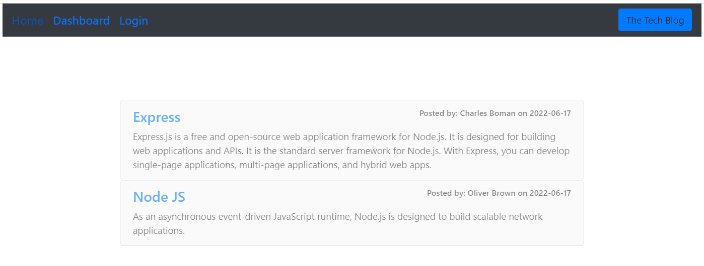
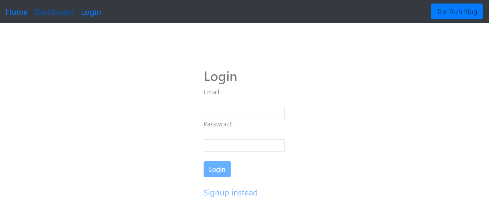
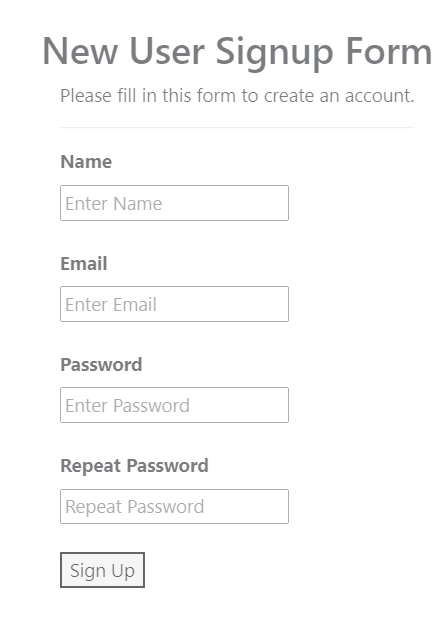
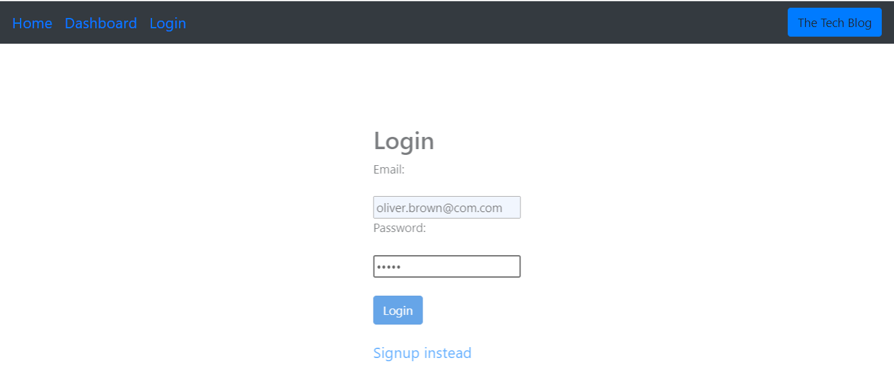
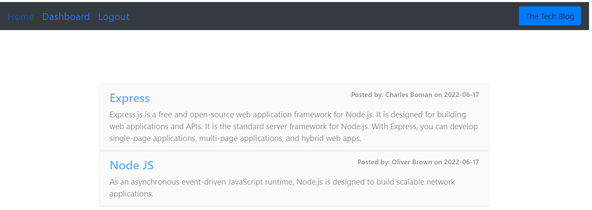
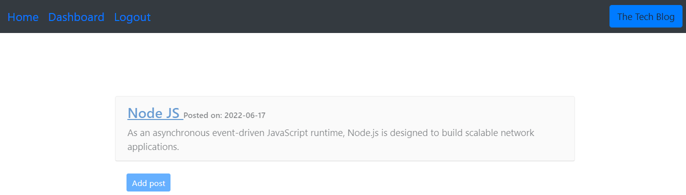
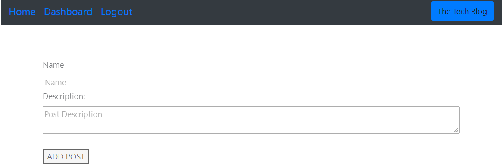
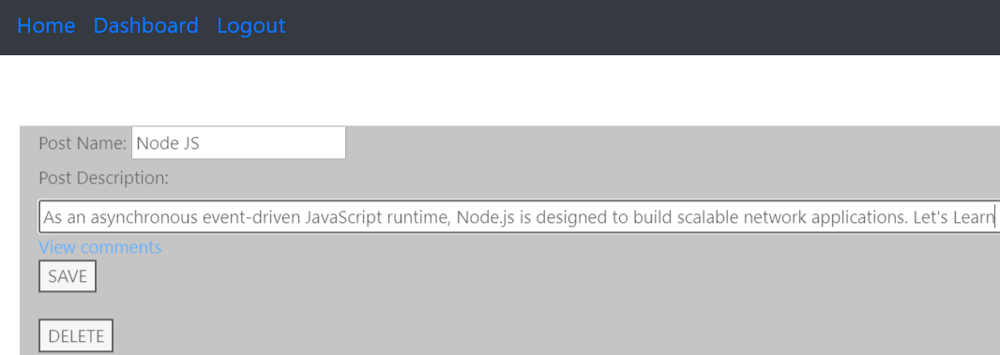
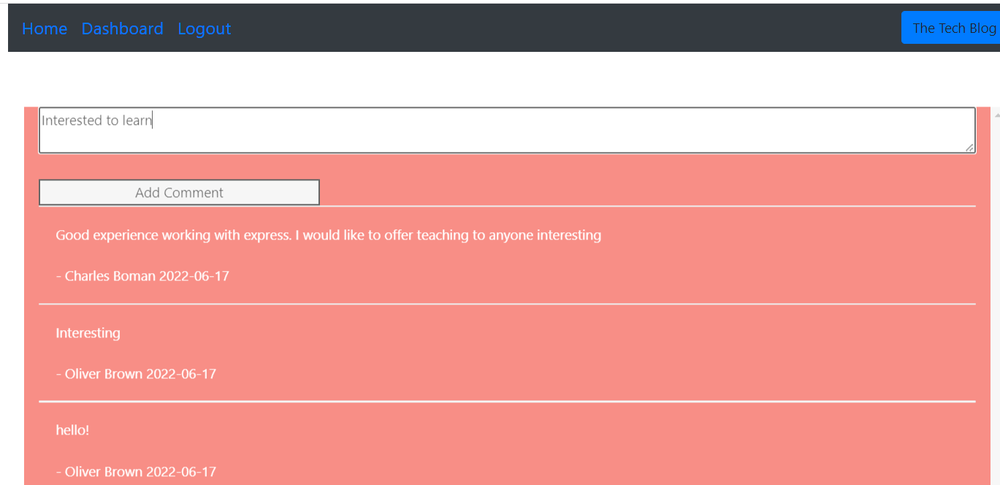
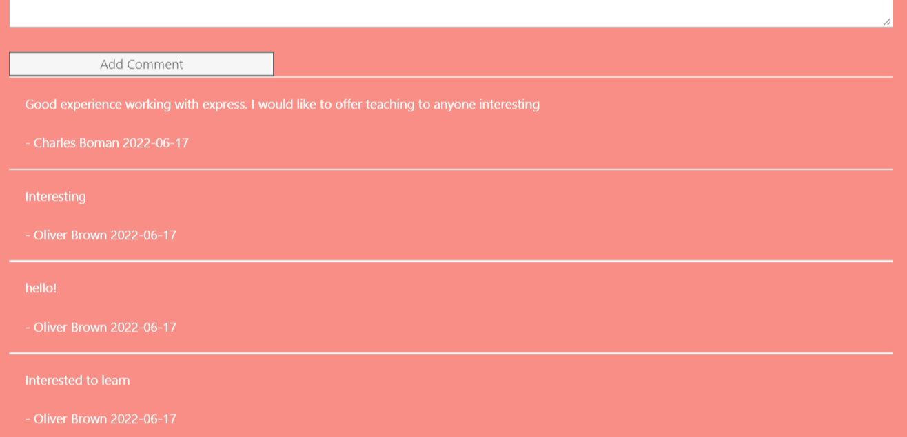

# TechBlog

## Welcome to the Tech Blog.

### You can navigate and make use of it.

### The first screen when you visit the Tech Blog, all the blog posts are listed. 

### You can click on Dashboard to view your blog posts only (if you are already signed up with tech blog).
### Expect to see this screen if you are not logged in or you are not signed up with techblog

### you can always use login or signup options.

### After successful sign or login, the page redirects to homepage

### If you are a member, you can view your posts under dashboard

### If you are a member, you can view your posts under dashboard

### click on save  to save existing  blog post. and click delete to remove your posts.

### homepage also offers a feature to add comments to existing posts. click on the blog title and you will be taken to a comment page screen, where you can add your comments/messages.

### you can see that the comment that you added is listed at the bottom

### Here is the video walk through link
https://drive.google.com/file/d/1TtRfZmJEn66sZabkhnzc705FzTxUJZr1/view

## Hope Tech Blog will be part of your learning journey!

